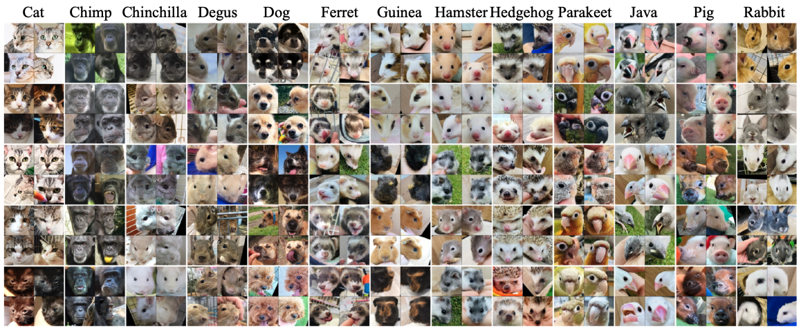

# PetFace (ECCV2024)
<a href='https://arxiv.org/abs/2407.13555'></a> &nbsp; 
<a href='https://dahlian00.github.io/PetFacePage/'></a> &nbsp; 

The official PyTorch implementation for the following paper:
> [**PetFace: A Large-Scale Dataset and Benchmark for Animal Identification**](https://arxiv.org/abs/2407.13555),  
> [Risa Shionoda](https://sites.google.com/view/risashinoda/home)* and [Kaede Shiohara](https://mapooon.github.io/)* (*Equal contribution),   
> *ECCV 2024*

## TL;DR: We established a large-scale animal identification dataset with more than 250k IDs across 13 families




# !!!Attention!!!
### Our PetFace dataset, code in this repository, and pretrained models are  **for non-commercial research purpose only**.

# Changelog
[2024/07/27] Pretrained models, training code, and evaluation were released. Also, "split" folder is updated.  
[2024/07/19] This repository was released.  

# Dataset
Fill in a [google form](https://docs.google.com/forms/d/e/1FAIpQLSfRPJaCmU6oQ4X_uB6H-EM5MSeczKczZxbQ5H9FMRS4KNY59w/viewform) for access to the dataset.

## Dataset directory
Place the dataset as follows:
```
. (Root of this repository)
└── data
    └── PetFace
        ├── images
        │   └── cat
        │       └── 000000
        │           └── 00.png
        ├── split
        │   └── cat
        │       ├── train.csv
        │       ├── val.txt
        │       ├── test.txt
        │       ├── reidentification.csv 
        │       └── verification.csv
        └── annotations
            └── cat.csv
         
```
train.csv: file names and id labels for training  
val.txt: file names for validation (not used in this codebase)  
test.txt: file names for verification (not used in this codebase)  
verification.csv: pairs of file names to verify and labels indicating whether the pairs have the same ID  
reidentification.csv: file names and id labels for re-identification  

# Setup
Install packages:
```
pip install -r requirements.txt
```

# Testing
Pretrained weights are provided on [google drive](https://drive.google.com/drive/folders/1XZHxlvRUZSQeFrztz0GaKgyVUSCh1lT6?usp=sharing). 

## Re-identification
For example, you can run the evaluation of re-identification for cat as follows:
```
CUDA_VISIBLE_DEVICES=0 python3 src/reidentification.py -m arcface -w pretrained/arcface/cat.pt -i data/PetFace/split/cat/reidentification.csv -o results/reidentification/arcface/cat.csv
```
Then, you can compute the top-k (k={1,2,3,4,5}) accuracy:
```
python3 src/compute_topk_acc.py --topk 5 -i results/reidentification/arcface/cat.csv
```

## Verification
For example, you can run the evaluation of re-identification for cat as follows:
```
CUDA_VISIBLE_DEVICES=0 python3 src/verification.py -w pretrained/arcface/cat.pt -i data/PetFace/split/cat/verification.csv -o results/verification/arcface/cat.csv
```
Then, you can compute AUC:
```
python3 src/compute_auc.py -i results/verification/arcface/cat.csv
```


# Training
For example, you can run the training for cat as follows:
```
CUDA_VISIBLE_DEVICES=0 python3 src/train_arcface.py src/configs/cat.py  --output outputs/cat/arcface
```

Also, you can train an arcface model on all the species (families):
```
CUDA_VISIBLE_DEVICES=0 python3 src/train_unfied.py src/configs/unified.py  --output outputs/unified
```

# Acknowledgement
We borrow some code from [insightface](https://github.com/deepinsight/insightface), [pytorch-center-loss](https://github.com/KaiyangZhou/pytorch-center-loss), and [triplet-loss-with-pytorch](https://www.kaggle.com/code/hirotaka0122/triplet-loss-with-pytorch).

# Citation
If you find our work useful for your research, please consider citing our paper:
```bibtex
@article{shinoda2024petface,
  title={PetFace: A Large-Scale Dataset and Benchmark for Animal Identification},
  author={Shinoda, Risa and Shiohara, Kaede},
  journal={arXiv preprint arXiv:2407.13555},
  year={2024}
}
```